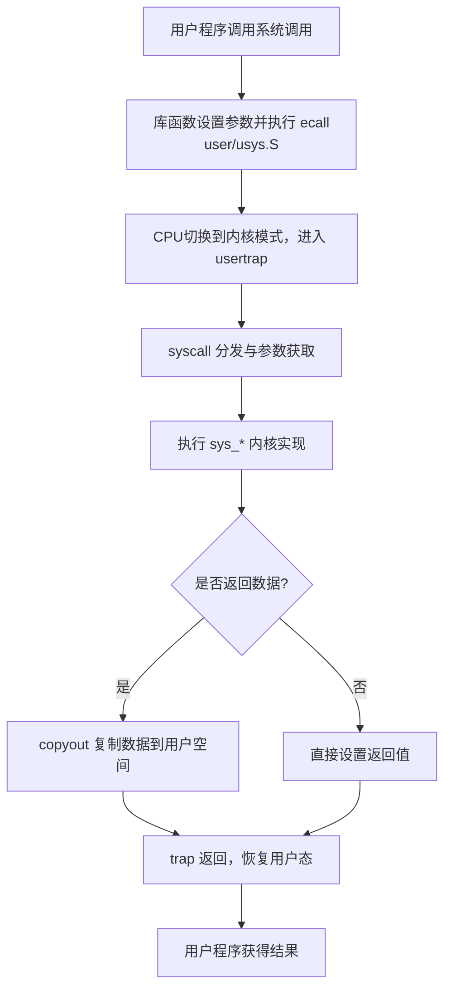

# Programming_Paradigms_Assignments
2024同济大学程序设计范式课程作业和五子棋期中作业

## 仓库组成

[第一次作业](https://github.com/ycc250303/Programming_Paradigms_Assignments/tree/main/Assignment_1)

[第二次作业](https://github.com/ycc250303/Programming_Paradigms_Assignments/tree/main/Assignment_2) 

[第三次作业](https://github.com/ycc250303/Programming_Paradigms_Assignments/tree/main/Assignment_3)

[第四次作业](https://github.com/ycc250303/Programming_Paradigms_Assignments/tree/main/Assignment_4)

[五子棋](https://github.com/ycc250303/Programming_Paradigms_Assignments/tree/main/gomoku)

